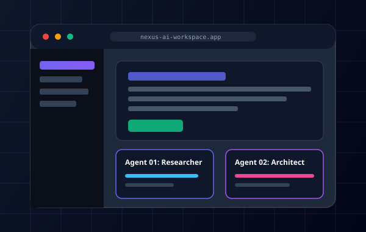

# 🚀 Todd Lin - 個人網站與作品集專案 (Personal Portfolio)

現代化、高性能、極致視覺質感的個人網站專案。



## ✨ 特色亮點

- 🎨 **暗黑玻璃擬態美學 (Glassmorphism & Cyber Theme)**：深度配色、氛圍光暈與高質感半透明毛玻璃層次。
- 🌟 **5 款主題色切換**：內建 Cyber Indigo、Neon Emerald、Sunset Rose、Cyberpunk Amber、Electric Cyan 隨點即換並記住設定。
- 🌌 **互動式粒子星座背景 (Canvas Background)**：高效能原生效能渲染，隨滑鼠游標產生互動與引力排斥。
- 🃏 **3D 視差卡片懸浮 (Tilt 3D Effect)**：專案作品卡片隨游標角度即時呈現 3D 俯仰與光澤反射。
- 🔊 **純 Web Audio API 合成音效**：零額外音檔體積，微小高科技按鍵與反饋音效（支援一鍵靜音）。
- 📝 **動態打字機特效 (Typewriter)**：Hero 區塊循環展示多重專業職能與定位。
- 📦 **單一資料來源架構 (`js/data.js`)**：所有文字、專案、技能、經歷集中在一個檔案，修改零門檻。
- 📱 **100% 響應式與無障礙設計 (Responsive & A11y)**：桌機、平板、手機完美自適應。

---

## 📁 專案目錄結構

```
test_1/
├── index.html              # 主頁面結構與 SEO / OpenGraph 設定
├── README.md               # 專案說明文件
├── assets/                 # 向量圖示與預覽素材
│   ├── avatar.svg          # 個人頭像
│   ├── favicon.svg         # 網站圖示
│   ├── project-nexus.svg   # 專案預覽圖 1
│   ├── project-hyper.svg   # 專案預覽圖 2
│   ├── project-zenith.svg  # 專案預覽圖 3
│   └── project-sentinel.svg# 專案預覽圖 4
├── css/
│   ├── variables.css       # 色彩、字體與主題 Design Tokens
│   ├── base.css            # CSS Reset、字體、捲軸與容器排版
│   ├── components.css      # 導航、Hero、卡片、Modal、表單等元件樣式
│   └── animations.css      # 關鍵影格動畫與滾動顯現特效
└── js/
    ├── data.js             # 💡 個人資料、專案、技能、經歷數據中心
    ├── canvas-bg.js        # Canvas 互動環境粒子畫布
    ├── tilt.js             # 原生 3D 卡片視差懸浮
    ├── audio-fx.js         # Web Audio API 合成音效引擎
    └── app.js              # 主控制邏輯、滾動監聽、篩選器與 Modal
```

---

## 🛠️ 本地快速啟動

專案採用原生現代前端架構，無需繁瑣的 `npm install` 即可秒級運行：

### 方法一：使用 Python 內建伺服器（推薦）
```bash
# 在專案目錄執行：
python3 -m http.server 3000
```
瀏覽器開啟：`http://localhost:3000`

### 方法二：使用 VS Code / IDE Live Server
右鍵點選 `index.html` 選擇 **"Open with Live Server"** 即可。

---

## ✏️ 如何自訂你的資料？

直接開啟 [`js/data.js`](file:///Users/todd.lin/Antigravity%20IDE/test_1/js/data.js)，修改對應欄位即可：
- `profile`: 姓名、簡介、頭像、社群連結、統計數據
- `about`: 核心價值三支柱 (Pillars)
- `skillCategories`: 技能分類與技術標籤
- `projects`: 作品集清單（包含分類、圖片、線上預覽與 GitHub 網址）
- `experience`: 職涯與經歷時光軸

---

## 🚢 部署上線

本專案為標準靜態網頁，可直接免費部署至：
- **GitHub Pages**: 將代碼 Push 到 GitHub 後於 Settings > Pages 開啟。
- **Vercel**: 連結 GitHub Repo 即可一鍵秒級部署。
- **Cloudflare Pages / Netlify**: 拖曳專案資料夾即可完成部署。
